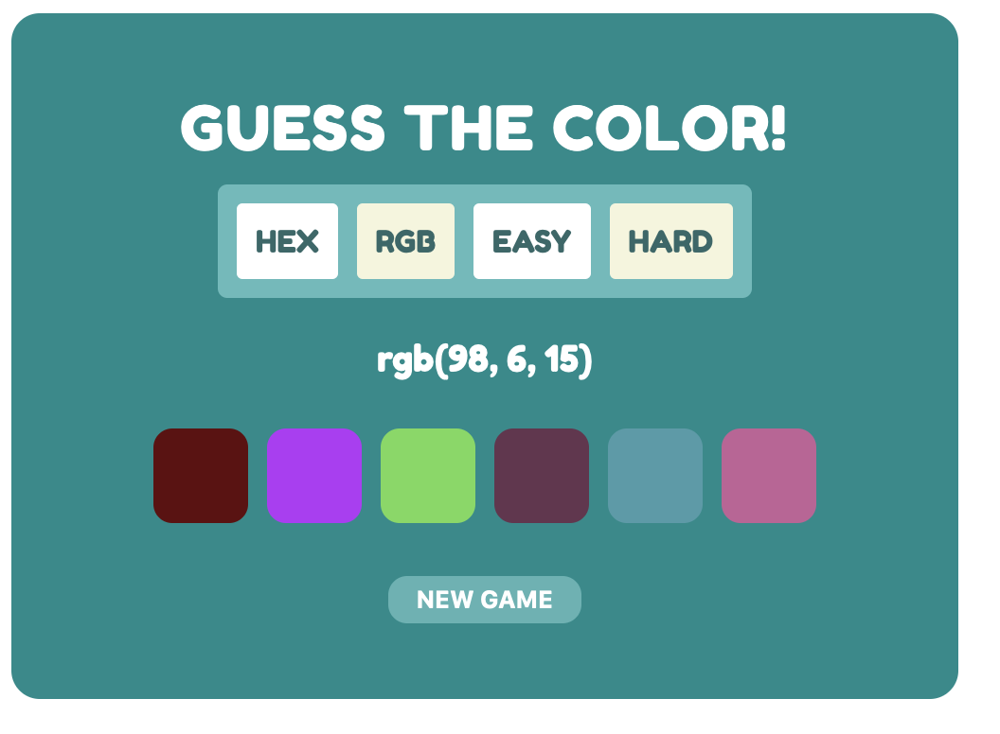

# GuessTheColor Game

## 💬 Project 

This basic todo-list web-app makes it possible to make different to-do-list, add tasks, edit tasks, delete tasks, add lists, delete lists. 

## 💬 Tools 

CSS, HTML, JavaScript

## 💬 Functionalities

* click button (new game) --> a new random color to guess is picked
* click on color boxes --> show if this color matches the picked color
* game options:
    - hard --> 6 colors to guess from
    - easy --> 4 colors to guess from
    - RGB --> guess the RGB notation of color
    - HEX --> guess the HEX notation of color
    
## 🚀 Preview

Have fun guessing...
https://guessthecolorgame.netlify.app

ENJOY!

